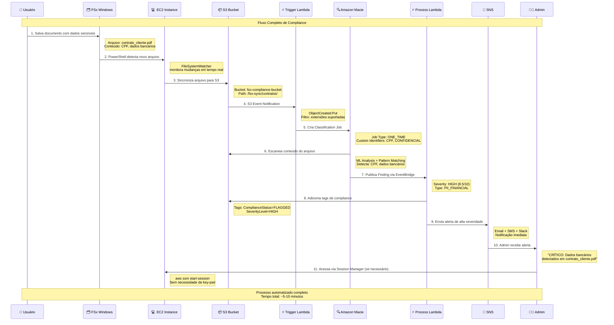
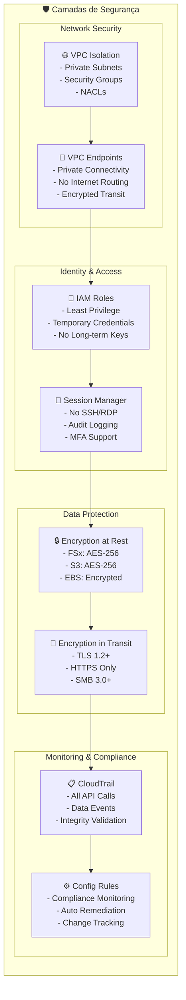
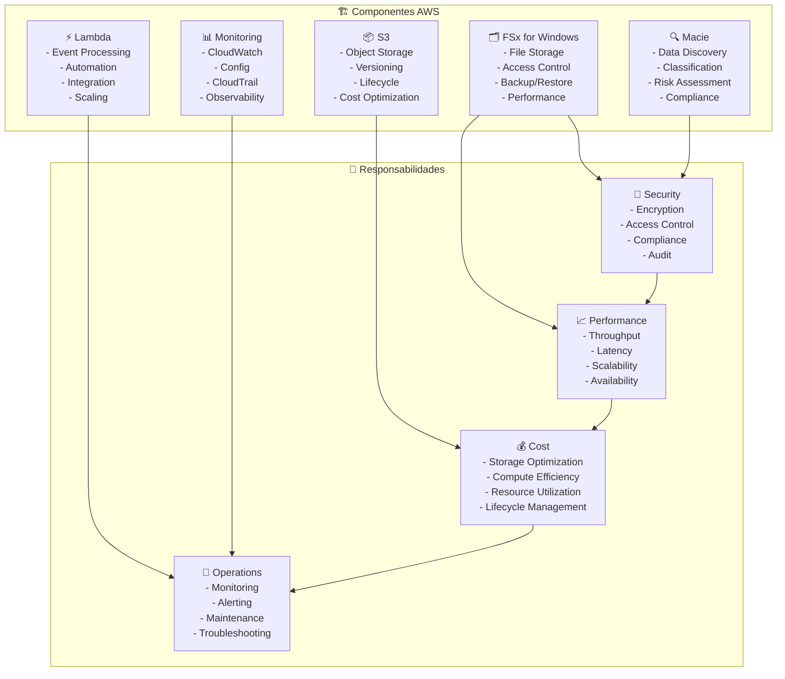
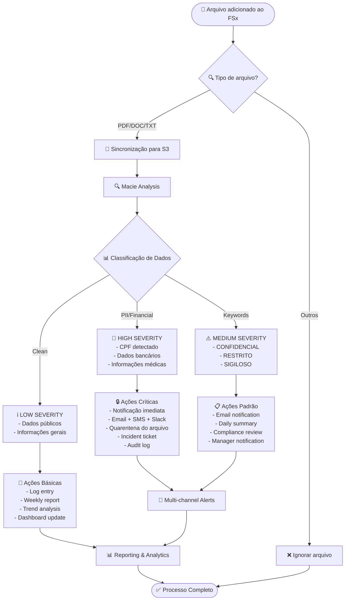

# Diagrama de Arquitetura - FSx Compliance PoC com Amazon Macie

## 🏗️ Arquitetura Completa da Solução

```mermaid
graph TB
    %% Definir estilos
    classDef userLayer fill:#e3f2fd,stroke:#1976d2,stroke-width:2px
    classDef networkLayer fill:#f3e5f5,stroke:#7b1fa2,stroke-width:2px
    classDef computeLayer fill:#e8f5e8,stroke:#388e3c,stroke-width:2px
    classDef storageLayer fill:#fff3e0,stroke:#f57c00,stroke-width:2px
    classDef securityLayer fill:#ffebee,stroke:#d32f2f,stroke-width:2px
    classDef monitoringLayer fill:#e0f2f1,stroke:#00796b,stroke-width:2px
    classDef notificationLayer fill:#fce4ec,stroke:#c2185b,stroke-width:2px

    %% Camada de Usuários
    subgraph "👥 Camada de Usuários"
        USER[("👤 Usuários Finais<br/>- Funcionários<br/>- Aplicações<br/>- Sistemas")]
        ADMIN[("👨‍💼 Administradores<br/>- Security Team<br/>- Compliance Team<br/>- IT Operations")]
    end

    %% Camada de Rede
    subgraph "🌐 Infraestrutura de Rede"
        subgraph "VPC (10.0.0.0/16)"
            subgraph "Public Subnet (10.0.2.0/24)"
                IGW["🌐 Internet Gateway"]
                NAT["🔄 NAT Gateway"]
                EIP["📍 Elastic IP"]
            end
            
            subgraph "Private Subnet (10.0.1.0/24)"
                EC2["💻 Windows EC2<br/>t3.medium<br/>- PowerShell Scripts<br/>- Auto Configuration<br/>- SSM Agent"]
                FSX[("🗂️ FSx for Windows<br/>32GB SSD<br/>- SMB/CIFS<br/>- Active Directory<br/>- Automatic Backups")]
                AD["🏢 Managed AD<br/>- Domain Controller<br/>- User Authentication<br/>- Group Policies"]
            end
            
            subgraph "VPC Endpoints"
                VPC_S3["🔗 S3 Gateway Endpoint"]
                VPC_SSM["🔗 SSM Interface Endpoint"]
                VPC_LAMBDA["🔗 Lambda Interface Endpoint"]
                VPC_EVENTS["🔗 EventBridge Interface Endpoint"]
            end
        end
        
        subgraph "Security Groups"
            SG_FSX["🛡️ FSx Security Group<br/>- Port 445 (SMB)<br/>- Port 135 (RPC)<br/>- Dynamic RPC ports"]
            SG_EC2["🛡️ EC2 Security Group<br/>- Port 443 (HTTPS)<br/>- Port 80 (HTTP)<br/>- No RDP (3389)"]
            SG_VPC["🛡️ VPC Endpoint SG<br/>- Port 443 (HTTPS)"]
        end
    end

    %% Camada de Armazenamento
    subgraph "💾 Camada de Armazenamento"
        S3[("📦 S3 Compliance Bucket<br/>- Versioning Enabled<br/>- AES-256 Encryption<br/>- Lifecycle Policies<br/>- Event Notifications")]
        
        subgraph "S3 Structure"
            S3_SYNC["📁 /fsx-sync/<br/>- Arquivos sincronizados<br/>- Metadados preservados<br/>- Estrutura de diretórios"]
            S3_LOGS["📁 /logs/<br/>- Sync logs<br/>- Error logs<br/>- Audit trails"]
        end
    end

    %% Camada de Processamento
    subgraph "⚡ Camada de Processamento"
        LAMBDA1["🚀 Trigger Lambda<br/>- S3 Event Processing<br/>- Macie Job Creation<br/>- File Type Filtering<br/>- Metadata Tagging"]
        
        LAMBDA2["🚀 Findings Lambda<br/>- EventBridge Processing<br/>- Severity Classification<br/>- Alert Generation<br/>- Response Actions"]
        
        SCHEDULER["⏰ EventBridge Scheduler<br/>- Daily Sync Jobs<br/>- Periodic Scans<br/>- Maintenance Tasks"]
    end

    %% Camada de Segurança e Compliance
    subgraph "🔍 Camada de Segurança e Compliance"
        MACIE["🔍 Amazon Macie<br/>- Data Discovery<br/>- PII Detection<br/>- Custom Identifiers<br/>- ML Classification"]
        
        subgraph "Macie Components"
            MACIE_JOBS["⚙️ Classification Jobs<br/>- Scheduled Jobs<br/>- One-time Jobs<br/>- Custom Rules"]
            MACIE_FINDINGS["📊 Findings Database<br/>- Severity Scores<br/>- Data Types<br/>- Risk Assessment"]
            MACIE_CUSTOM["🎯 Custom Identifiers<br/>- CONFIDENCIAL<br/>- RESTRITO<br/>- SIGILOSO<br/>- Regex Patterns"]
        end
        
        CONFIG["⚙️ AWS Config<br/>- Compliance Rules<br/>- Resource Tracking<br/>- Remediation Actions"]
        
        TRAIL["📋 CloudTrail<br/>- API Logging<br/>- Access Audit<br/>- Compliance Trail"]
    end

    %% Camada de Monitoramento
    subgraph "📊 Camada de Monitoramento"
        CW["📈 CloudWatch<br/>- Metrics Collection<br/>- Log Aggregation<br/>- Custom Dashboards"]
        
        subgraph "CloudWatch Components"
            CW_LOGS["📝 CloudWatch Logs<br/>- Lambda Logs<br/>- EC2 Logs<br/>- Application Logs"]
            CW_METRICS["📊 CloudWatch Metrics<br/>- File Count<br/>- Scan Results<br/>- Error Rates"]
            CW_ALARMS["🚨 CloudWatch Alarms<br/>- Threshold Alerts<br/>- Anomaly Detection<br/>- Auto Scaling"]
        end
        
        XRAY["🔍 X-Ray Tracing<br/>- Request Tracing<br/>- Performance Analysis<br/>- Error Tracking"]
    end

    %% Camada de Notificações
    subgraph "📨 Camada de Notificações e Alertas"
        EB["📡 EventBridge<br/>- Event Routing<br/>- Pattern Matching<br/>- Multi-target Delivery"]
        
        SNS["📧 SNS Topics<br/>- Email Notifications<br/>- SMS Alerts<br/>- Slack Integration"]
        
        SQS["📥 SQS Queues<br/>- Message Buffering<br/>- Dead Letter Queues<br/>- Retry Logic"]
        
        subgraph "Notification Types"
            ALERT_HIGH["🚨 High Severity<br/>- Immediate Email<br/>- SMS Alert<br/>- Slack Notification"]
            ALERT_MED["⚠️ Medium Severity<br/>- Email Notification<br/>- Daily Summary"]
            ALERT_LOW["ℹ️ Low Severity<br/>- Weekly Report<br/>- Dashboard Update"]
        end
    end

    %% Camada de Visualização
    subgraph "📊 Camada de Visualização e Relatórios"
        QS["📊 QuickSight<br/>- Compliance Dashboards<br/>- Trend Analysis<br/>- Executive Reports<br/>- Data Visualization"]
        
        SEC_HUB["🔒 Security Hub<br/>- Centralized Findings<br/>- Compliance Scores<br/>- Remediation Tracking<br/>- Multi-account View"]
        
        subgraph "Dashboard Types"
            DASH_EXEC["👔 Executive Dashboard<br/>- High-level Metrics<br/>- Compliance Status<br/>- Risk Overview"]
            DASH_OPS["🔧 Operations Dashboard<br/>- System Health<br/>- Performance Metrics<br/>- Error Tracking"]
            DASH_SEC["🛡️ Security Dashboard<br/>- Threat Detection<br/>- Vulnerability Status<br/>- Incident Response"]
        end
    end

    %% Fluxos de Dados Principais
    USER --> FSX
    FSX --> EC2
    EC2 --> S3
    S3 --> LAMBDA1
    LAMBDA1 --> MACIE_JOBS
    MACIE --> MACIE_FINDINGS
    MACIE_FINDINGS --> EB
    EB --> LAMBDA2
    LAMBDA2 --> SNS
    LAMBDA2 --> SQS

    %% Fluxos de Monitoramento
    LAMBDA1 --> CW_LOGS
    LAMBDA2 --> CW_LOGS
    EC2 --> CW_LOGS
    MACIE_FINDINGS --> CW_METRICS
    CW_METRICS --> CW_ALARMS
    CW_ALARMS --> SNS

    %% Fluxos de Compliance
    FSX --> CONFIG
    EC2 --> TRAIL
    S3 --> TRAIL
    LAMBDA1 --> TRAIL
    LAMBDA2 --> TRAIL

    %% Fluxos de Visualização
    MACIE_FINDINGS --> SEC_HUB
    CW_METRICS --> QS
    SEC_HUB --> QS
    CONFIG --> SEC_HUB

    %% Fluxos de Rede
    IGW --> NAT
    NAT --> EC2
    EC2 --> VPC_S3
    EC2 --> VPC_SSM
    VPC_S3 --> S3
    VPC_SSM --> EC2

    %% Fluxos de Acesso
    ADMIN --> VPC_SSM
    VPC_SSM --> EC2

    %% Aplicar estilos
    class USER,ADMIN userLayer
    class IGW,NAT,EIP,VPC_S3,VPC_SSM,VPC_LAMBDA,VPC_EVENTS,SG_FSX,SG_EC2,SG_VPC networkLayer
    class EC2,LAMBDA1,LAMBDA2,SCHEDULER computeLayer
    class FSX,S3,S3_SYNC,S3_LOGS,AD storageLayer
    class MACIE,MACIE_JOBS,MACIE_FINDINGS,MACIE_CUSTOM,CONFIG,TRAIL securityLayer
    class CW,CW_LOGS,CW_METRICS,CW_ALARMS,XRAY monitoringLayer
    class EB,SNS,SQS,ALERT_HIGH,ALERT_MED,ALERT_LOW,QS,SEC_HUB,DASH_EXEC,DASH_OPS,DASH_SEC notificationLayer
```

## 🔄 Fluxo de Dados Detalhado

## 🔒 Arquitetura de Segurança

## 📊 Matriz de Responsabilidades

## 🎯 Cenários de Uso Específicos

