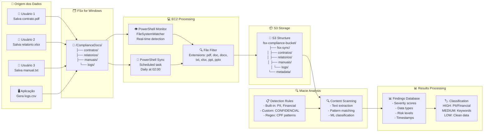
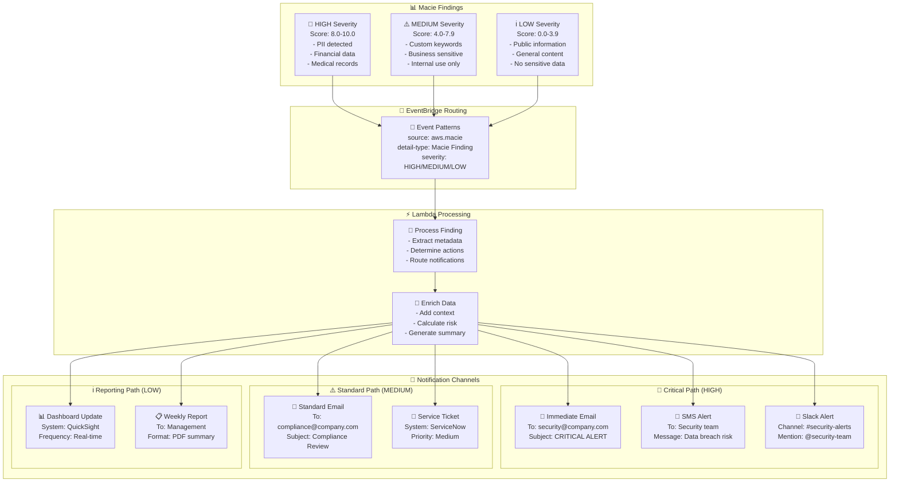
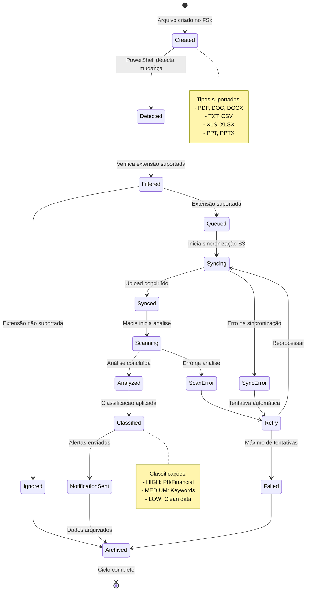
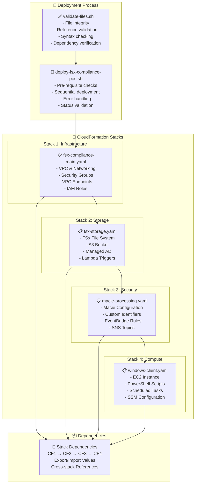

# Fluxos de Dados e Integrações - FSx Compliance PoC

## 🔄 Fluxo de Dados Principal

## 🚨 Fluxo de Alertas e Notificações

## 🔄 Ciclo de Vida dos Dados

## 🏗️ Arquitetura de Deployment

## 📊 Métricas e KPIs

```mermaid
graph LR
    subgraph "📈 Operational Metrics"
        OP1[📁 Files Processed<br/>- Total files scanned<br/>- Files per day<br/>- Processing rate<br/>- Queue depth]
        OP2[⏱️ Performance<br/>- Sync latency<br/>- Scan duration<br/>- End-to-end time<br/>- Error rates]
        OP3[💰 Cost Metrics<br/>- S3 storage costs<br/>- Macie scan costs<br/>- Lambda execution<br/>- Data transfer]
    end
    
    subgraph "🔒 Security Metrics"
        SEC1[🚨 Findings Count<br/>- HIGH severity<br/>- MEDIUM severity<br/>- LOW severity<br/>- Trends over time]
        SEC2[🎯 Detection Rate<br/>- True positives<br/>- False positives<br/>- Coverage percentage<br/>- Accuracy metrics]
        SEC3[⚡ Response Time<br/>- Alert to notification<br/>- Time to remediation<br/>- Incident resolution<br/>- SLA compliance]
    end
    
    subgraph "📊 Compliance Metrics"
        COMP1[✅ Compliance Score<br/>- Overall percentage<br/>- Policy adherence<br/>- Risk reduction<br/>- Audit readiness]
        COMP2[📋 Audit Trail<br/>- Access logs<br/>- Change tracking<br/>- Data lineage<br/>- Retention compliance]
        COMP3[🎯 Coverage<br/>- Files scanned %<br/>- Data types covered<br/>- Risk areas identified<br/>- Remediation rate]
    end
    
    OP1 --> OP2
    OP2 --> OP3
    SEC1 --> SEC2
    SEC2 --> SEC3
    COMP1 --> COMP2
    COMP2 --> COMP3
    
    OP3 --> SEC1
    SEC3 --> COMP1
```

