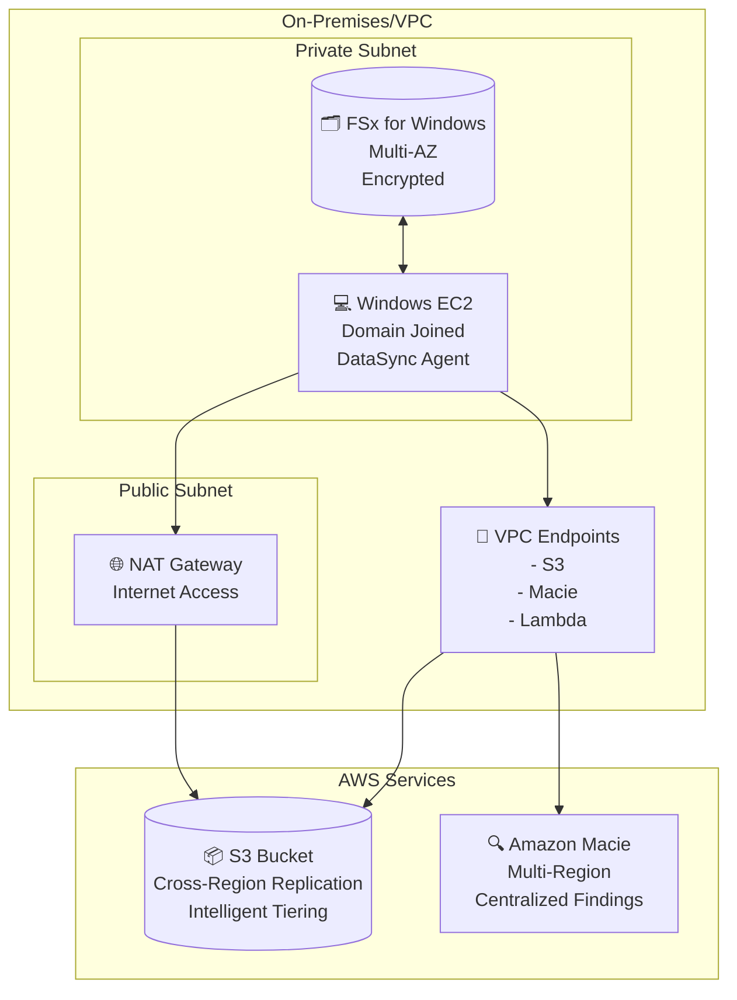
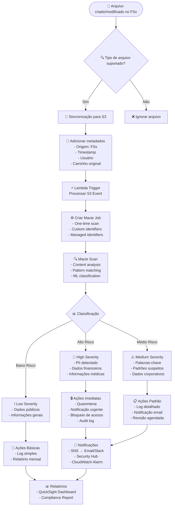
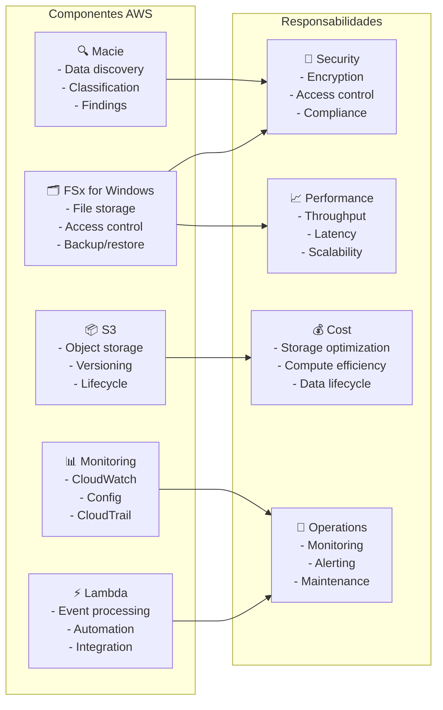
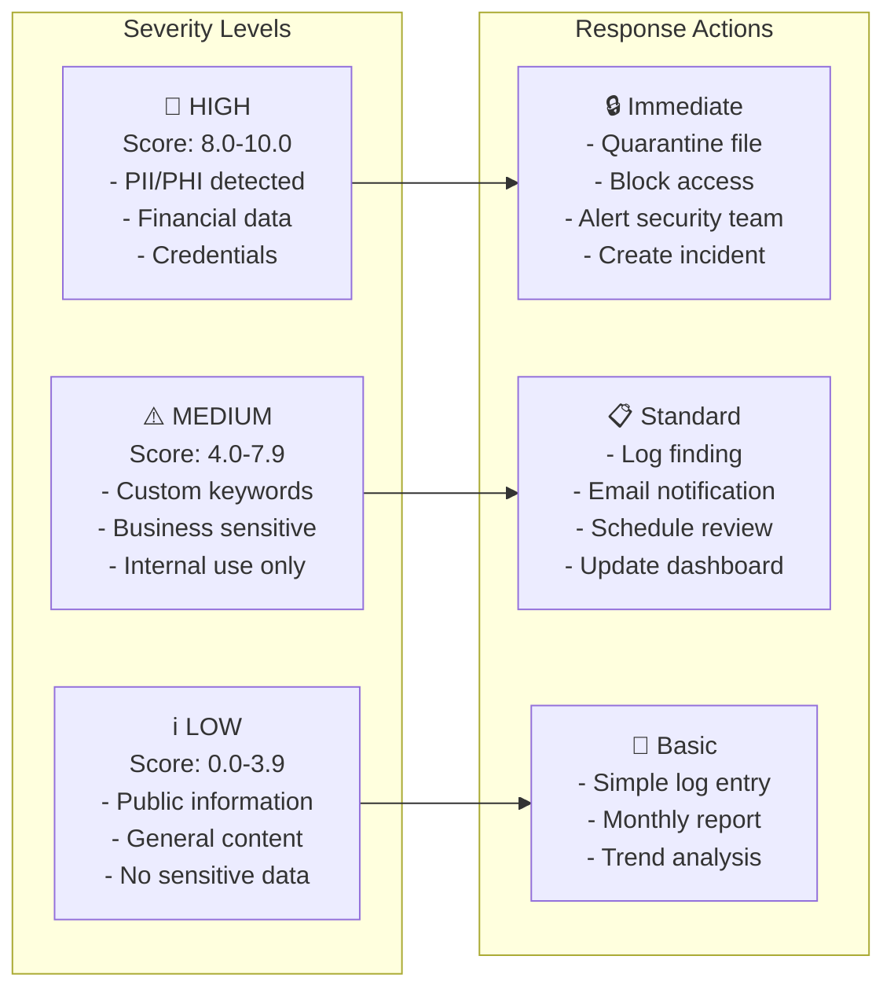

# Fluxos de Integração e Casos de Uso Específicos

## Arquitetura de Rede e Conectividade

## Fluxo de Classificação de Dados

## Matriz de Responsabilidades

## Cenários de Uso Específicos

```mermaid
graph TD
    subgraph "Cenário 1: Documento Confidencial"
        S1_1[👤 Usuário salva contrato.pdf<br/>com dados pessoais]
        S1_2[🔄 DataSync detecta e envia para S3]
        S1_3[🔍 Macie identifica CPF e dados bancários]
        S1_4[🚨 Alerta HIGH severity]
        S1_5[🔒 Arquivo movido para quarentena]
        S1_6[📨 Notificação imediata para compliance]
        
        S1_1 --> S1_2 --> S1_3 --> S1_4 --> S1_5 --> S1_6
    end
    
    subgraph "Cenário 2: Relatório Corporativo"
        S2_1[👤 Usuário salva relatorio_vendas.xlsx<br/>com palavra 'CONFIDENCIAL']
        S2_2[🔄 PowerShell script detecta mudança]
        S2_3[🔍 Macie identifica palavra-chave customizada]
        S2_4[⚠️ Alerta MEDIUM severity]
        S2_5[📋 Log detalhado criado]
        S2_6[📧 Email para gestor do departamento]
        
        S2_1 --> S2_2 --> S2_3 --> S2_4 --> S2_5 --> S2_6
    end
    
    subgraph "Cenário 3: Arquivo Público"
        S3_1[👤 Usuário salva manual_usuario.pdf<br/>sem dados sensíveis]
        S3_2[🔄 Sincronização normal]
        S3_3[🔍 Macie não encontra padrões sensíveis]
        S3_4[ℹ️ Classificação LOW severity]
        S3_5[📝 Log básico apenas]
        S3_6[📊 Incluído em relatório mensal]
        
        S3_1 --> S3_2 --> S3_3 --> S3_4 --> S3_5 --> S3_6
    end
```

## Configuração de Alertas e Thresholds

