# Fluxos de Integração e Casos de Uso Específicos

## Arquitetura de Rede e Conectividade

```mermaid
graph TB
    subgraph "On-Premises/VPC"
        subgraph "Private Subnet"
            FSX[("🗂️ FSx for Windows<br/>Multi-AZ<br/>Encrypted")]
            EC2["💻 Windows EC2<br/>Domain Joined<br/>DataSync Agent"]
        end
        
        subgraph "Public Subnet"
            NAT["🌐 NAT Gateway<br/>Internet Access"]
        end
        
        VPC_EP["🔗 VPC Endpoints<br/>- S3<br/>- Macie<br/>- Lambda"]
    end
    
    subgraph "AWS Services"
        S3[("📦 S3 Bucket<br/>Cross-Region Replication<br/>Intelligent Tiering")]
        MACIE["🔍 Amazon Macie<br/>Multi-Region<br/>Centralized Findings"]
    end
    
    FSX <--> EC2
    EC2 --> VPC_EP
    EC2 --> NAT
    VPC_EP --> S3
    VPC_EP --> MACIE
    NAT --> S3
```

## Fluxo de Classificação de Dados

```mermaid
flowchart TD
    START([📁 Arquivo criado/modificado no FSx]) --> DETECT{🔍 Tipo de arquivo suportado?}
    
    DETECT -->|Sim| SYNC[🔄 Sincronização para S3]
    DETECT -->|Não| IGNORE[❌ Ignorar arquivo]
    
    SYNC --> METADATA[📝 Adicionar metadados<br/>- Origem: FSx<br/>- Timestamp<br/>- Usuário<br/>- Caminho original]
    
    METADATA --> TRIGGER[⚡ Lambda Trigger<br/>Processar S3 Event]
    
    TRIGGER --> CREATE_JOB[⚙️ Criar Macie Job<br/>- One-time scan<br/>- Custom identifiers<br/>- Managed identifiers]
    
    CREATE_JOB --> SCAN[🔍 Macie Scan<br/>- Content analysis<br/>- Pattern matching<br/>- ML classification]
    
    SCAN --> CLASSIFY{📊 Classificação}
    
    CLASSIFY -->|Alto Risco| HIGH[🚨 High Severity<br/>- PII detectado<br/>- Dados financeiros<br/>- Informações médicas]
    
    CLASSIFY -->|Médio Risco| MEDIUM[⚠️ Medium Severity<br/>- Palavras-chave<br/>- Padrões suspeitos<br/>- Dados corporativos]
    
    CLASSIFY -->|Baixo Risco| LOW[ℹ️ Low Severity<br/>- Dados públicos<br/>- Informações gerais]
    
    HIGH --> ACTION_HIGH[🔒 Ações Imediatas<br/>- Quarentena<br/>- Notificação urgente<br/>- Bloqueio de acesso<br/>- Audit log]
    
    MEDIUM --> ACTION_MEDIUM[📋 Ações Padrão<br/>- Log detalhado<br/>- Notificação email<br/>- Revisão agendada]
    
    LOW --> ACTION_LOW[📝 Ações Básicas<br/>- Log simples<br/>- Relatório mensal]
    
    ACTION_HIGH --> NOTIFY[📨 Notificações<br/>- SNS → Email/Slack<br/>- Security Hub<br/>- CloudWatch Alarm]
    
    ACTION_MEDIUM --> NOTIFY
    ACTION_LOW --> REPORT[📊 Relatórios<br/>- QuickSight Dashboard<br/>- Compliance Report]
    
    NOTIFY --> REPORT
```

## Matriz de Responsabilidades

```mermaid
graph LR
    subgraph "Componentes AWS"
        A["🗂️ FSx for Windows<br/>- File storage<br/>- Access control<br/>- Backup/restore"]
        B["📦 S3<br/>- Object storage<br/>- Versioning<br/>- Lifecycle"]
        C["🔍 Macie<br/>- Data discovery<br/>- Classification<br/>- Findings"]
        D["⚡ Lambda<br/>- Event processing<br/>- Automation<br/>- Integration"]
        E["📊 Monitoring<br/>- CloudWatch<br/>- Config<br/>- CloudTrail"]
    end
    
    subgraph "Responsabilidades"
        R1["🔐 Security<br/>- Encryption<br/>- Access control<br/>- Compliance"]
        R2["📈 Performance<br/>- Throughput<br/>- Latency<br/>- Scalability"]
        R3["💰 Cost<br/>- Storage optimization<br/>- Compute efficiency<br/>- Data lifecycle"]
        R4["🔧 Operations<br/>- Monitoring<br/>- Alerting<br/>- Maintenance"]
    end
    
    A --> R1
    A --> R2
    B --> R3
    C --> R1
    D --> R4
    E --> R4
```

## Cenários de Uso Específicos

```mermaid
graph TD
    subgraph "Cenário 1: Documento Confidencial"
        S1_1[👤 Usuário salva contrato.pdf<br/>com dados pessoais]
        S1_2[🔄 DataSync detecta e envia para S3]
        S1_3[🔍 Macie identifica CPF e dados bancários]
        S1_4[🚨 Alerta HIGH severity]
        S1_5[🔒 Arquivo movido para quarentena]
        S1_6[📨 Notificação imediata para compliance]
        
        S1_1 --> S1_2 --> S1_3 --> S1_4 --> S1_5 --> S1_6
    end
    
    subgraph "Cenário 2: Relatório Corporativo"
        S2_1[👤 Usuário salva relatorio_vendas.xlsx<br/>com palavra 'CONFIDENCIAL']
        S2_2[🔄 PowerShell script detecta mudança]
        S2_3[🔍 Macie identifica palavra-chave customizada]
        S2_4[⚠️ Alerta MEDIUM severity]
        S2_5[📋 Log detalhado criado]
        S2_6[📧 Email para gestor do departamento]
        
        S2_1 --> S2_2 --> S2_3 --> S2_4 --> S2_5 --> S2_6
    end
    
    subgraph "Cenário 3: Arquivo Público"
        S3_1[👤 Usuário salva manual_usuario.pdf<br/>sem dados sensíveis]
        S3_2[🔄 Sincronização normal]
        S3_3[🔍 Macie não encontra padrões sensíveis]
        S3_4[ℹ️ Classificação LOW severity]
        S3_5[📝 Log básico apenas]
        S3_6[📊 Incluído em relatório mensal]
        
        S3_1 --> S3_2 --> S3_3 --> S3_4 --> S3_5 --> S3_6
    end
```

## Configuração de Alertas e Thresholds

```mermaid
graph LR
    subgraph "Severity Levels"
        HIGH["🚨 HIGH<br/>Score: 8.0-10.0<br/>- PII/PHI detected<br/>- Financial data<br/>- Credentials"]
        MEDIUM["⚠️ MEDIUM<br/>Score: 4.0-7.9<br/>- Custom keywords<br/>- Business sensitive<br/>- Internal use only"]
        LOW["ℹ️ LOW<br/>Score: 0.0-3.9<br/>- Public information<br/>- General content<br/>- No sensitive data"]
    end
    
    subgraph "Response Actions"
        A1["🔒 Immediate<br/>- Quarantine file<br/>- Block access<br/>- Alert security team<br/>- Create incident"]
        A2["📋 Standard<br/>- Log finding<br/>- Email notification<br/>- Schedule review<br/>- Update dashboard"]
        A3["📝 Basic<br/>- Simple log entry<br/>- Monthly report<br/>- Trend analysis"]
    end
    
    HIGH --> A1
    MEDIUM --> A2
    LOW --> A3
```

