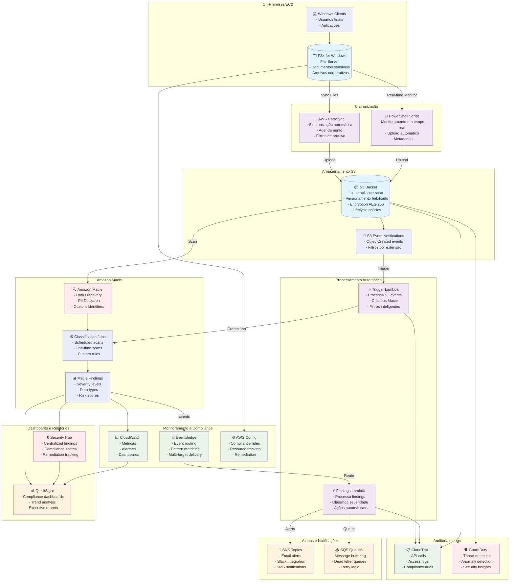
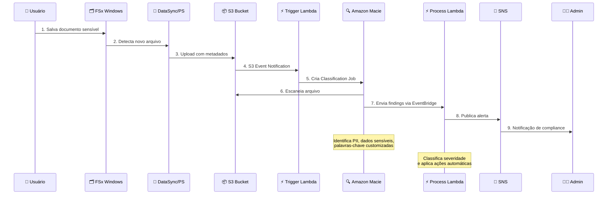
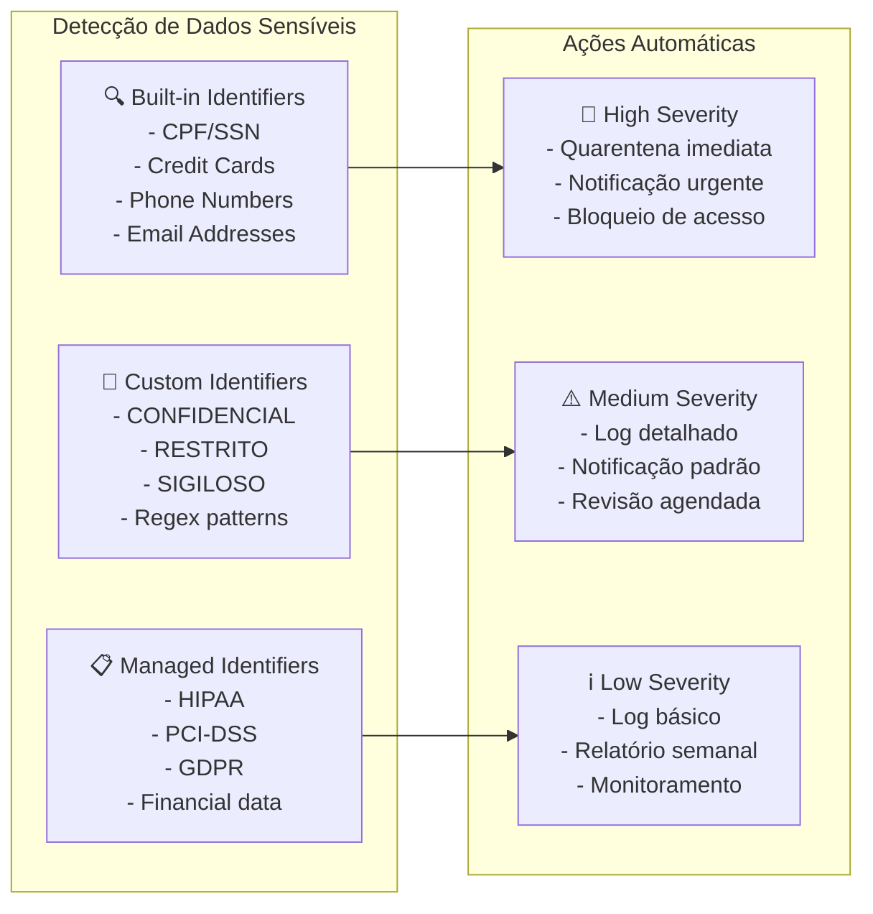
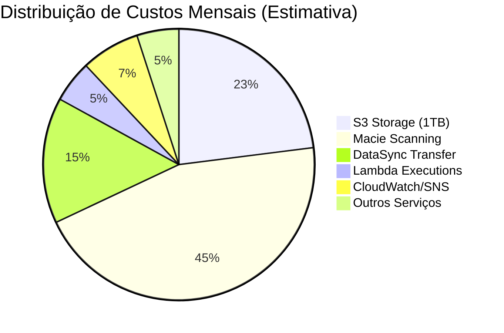
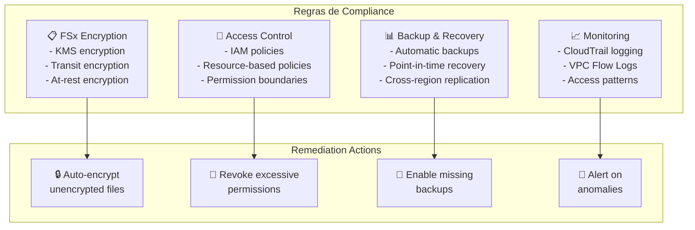

# Arquitetura de Compliance FSx for Windows com Amazon Macie

## Diagrama de Arquitetura Principal

## Fluxo de Dados Detalhado

## Componentes de Segurança Detalhados

## Custos Estimados (Região us-east-1)

## Configurações de Compliance

