# Arquitetura de Compliance FSx for Windows com Amazon Macie

## Diagrama de Arquitetura Principal

```mermaid
graph TB
    %% Camada de Dados e Origem
    subgraph "On-Premises/EC2"
        FSX[("🗂️ FSx for Windows<br/>File Server<br/>- Documentos sensíveis<br/>- Arquivos corporativos")]
        WIN["💻 Windows Clients<br/>- Usuários finais<br/>- Aplicações"]
        WIN --> FSX
    end

    %% Camada de Sincronização
    subgraph "Sincronização"
        DS["🔄 AWS DataSync<br/>- Sincronização automática<br/>- Agendamento<br/>- Filtros de arquivo"]
        PS["📜 PowerShell Script<br/>- Monitoramento em tempo real<br/>- Upload automático<br/>- Metadados"]
    end

    %% Camada de Armazenamento
    subgraph "Armazenamento S3"
        S3[("📦 S3 Bucket<br/>fsx-compliance-scan<br/>- Versionamento habilitado<br/>- Encryption AES-256<br/>- Lifecycle policies")]
        S3_EVENT["📢 S3 Event Notifications<br/>- ObjectCreated events<br/>- Filtros por extensão"]
    end

    %% Camada de Análise de Segurança
    subgraph "Amazon Macie"
        MACIE["🔍 Amazon Macie<br/>- Data Discovery<br/>- PII Detection<br/>- Custom Identifiers"]
        MACIE_JOB["⚙️ Classification Jobs<br/>- Scheduled scans<br/>- One-time scans<br/>- Custom rules"]
        MACIE_FINDINGS["📊 Macie Findings<br/>- Severity levels<br/>- Data types<br/>- Risk scores"]
    end

    %% Camada de Processamento
    subgraph "Processamento Automático"
        LAMBDA1["⚡ Trigger Lambda<br/>- Processa S3 events<br/>- Cria jobs Macie<br/>- Filtros inteligentes"]
        LAMBDA2["⚡ Findings Lambda<br/>- Processa findings<br/>- Classifica severidade<br/>- Ações automáticas"]
    end

    %% Camada de Monitoramento
    subgraph "Monitoramento e Compliance"
        EB["📡 EventBridge<br/>- Event routing<br/>- Pattern matching<br/>- Multi-target delivery"]
        CW["📈 CloudWatch<br/>- Métricas<br/>- Alarmes<br/>- Dashboards"]
        CONFIG["⚙️ AWS Config<br/>- Compliance rules<br/>- Resource tracking<br/>- Remediation"]
    end

    %% Camada de Auditoria
    subgraph "Auditoria e Logs"
        CT["📋 CloudTrail<br/>- API calls<br/>- Access logs<br/>- Compliance audit"]
        GUARD["🛡️ GuardDuty<br/>- Threat detection<br/>- Anomaly detection<br/>- Security insights"]
    end

    %% Camada de Notificação
    subgraph "Alertas e Notificações"
        SNS["📨 SNS Topics<br/>- Email alerts<br/>- Slack integration<br/>- SMS notifications"]
        SQS["📥 SQS Queues<br/>- Message buffering<br/>- Dead letter queues<br/>- Retry logic"]
    end

    %% Camada de Visualização
    subgraph "Dashboards e Relatórios"
        QS["📊 QuickSight<br/>- Compliance dashboards<br/>- Trend analysis<br/>- Executive reports"]
        SEC_HUB["🔒 Security Hub<br/>- Centralized findings<br/>- Compliance scores<br/>- Remediation tracking"]
    end

    %% Fluxo de Dados Principal
    FSX -->|Sync Files| DS
    FSX -->|Real-time Monitor| PS
    DS -->|Upload| S3
    PS -->|Upload| S3
    
    S3 --> S3_EVENT
    S3_EVENT -->|Trigger| LAMBDA1
    LAMBDA1 -->|Create Job| MACIE_JOB
    
    S3 -->|Scan| MACIE
    MACIE --> MACIE_JOB
    MACIE_JOB --> MACIE_FINDINGS
    
    MACIE_FINDINGS -->|Events| EB
    EB -->|Route| LAMBDA2
    LAMBDA2 -->|Alerts| SNS
    LAMBDA2 -->|Queue| SQS
    
    %% Monitoramento
    MACIE_FINDINGS --> CW
    MACIE_FINDINGS --> SEC_HUB
    FSX --> CONFIG
    
    %% Auditoria
    LAMBDA1 --> CT
    LAMBDA2 --> CT
    S3 --> CT
    S3 --> GUARD
    
    %% Relatórios
    MACIE_FINDINGS --> QS
    SEC_HUB --> QS
    CW --> QS

    %% Styling
    classDef storage fill:#e1f5fe
    classDef compute fill:#f3e5f5
    classDef security fill:#ffebee
    classDef monitoring fill:#e8f5e8
    classDef notification fill:#fff3e0
    
    class S3,FSX storage
    class LAMBDA1,LAMBDA2,DS,PS compute
    class MACIE,GUARD,SEC_HUB security
    class CW,CONFIG,CT,EB monitoring
    class SNS,SQS,QS notification
```

## Fluxo de Dados Detalhado

```mermaid
sequenceDiagram
    participant User as 👤 Usuário
    participant FSX as 🗂️ FSx Windows
    participant Sync as 🔄 DataSync/PS
    participant S3 as 📦 S3 Bucket
    participant Lambda1 as ⚡ Trigger Lambda
    participant Macie as 🔍 Amazon Macie
    participant Lambda2 as ⚡ Process Lambda
    participant SNS as 📨 SNS
    participant Admin as 👨‍💼 Admin

    User->>FSX: 1. Salva documento sensível
    FSX->>Sync: 2. Detecta novo arquivo
    Sync->>S3: 3. Upload com metadados
    S3->>Lambda1: 4. S3 Event Notification
    Lambda1->>Macie: 5. Cria Classification Job
    Macie->>S3: 6. Escaneia arquivo
    Macie->>Lambda2: 7. Envia findings via EventBridge
    Lambda2->>SNS: 8. Publica alerta
    SNS->>Admin: 9. Notificação de compliance
    
    Note over Macie: Identifica PII, dados sensíveis,<br/>palavras-chave customizadas
    Note over Lambda2: Classifica severidade<br/>e aplica ações automáticas
```

## Componentes de Segurança Detalhados

```mermaid
graph LR
    subgraph "Detecção de Dados Sensíveis"
        A["🔍 Built-in Identifiers<br/>- CPF/SSN<br/>- Credit Cards<br/>- Phone Numbers<br/>- Email Addresses"]
        B["🎯 Custom Identifiers<br/>- CONFIDENCIAL<br/>- RESTRITO<br/>- SIGILOSO<br/>- Regex patterns"]
        C["📋 Managed Identifiers<br/>- HIPAA<br/>- PCI-DSS<br/>- GDPR<br/>- Financial data"]
    end
    
    subgraph "Ações Automáticas"
        D["🚨 High Severity<br/>- Quarentena imediata<br/>- Notificação urgente<br/>- Bloqueio de acesso"]
        E["⚠️ Medium Severity<br/>- Log detalhado<br/>- Notificação padrão<br/>- Revisão agendada"]
        F["ℹ️ Low Severity<br/>- Log básico<br/>- Relatório semanal<br/>- Monitoramento"]
    end
    
    A --> D
    B --> E
    C --> F
```

## Custos Estimados (Região us-east-1)

```mermaid
pie title Distribuição de Custos Mensais (Estimativa)
    "S3 Storage (1TB)" : 23
    "Macie Scanning" : 45
    "DataSync Transfer" : 15
    "Lambda Executions" : 5
    "CloudWatch/SNS" : 7
    "Outros Serviços" : 5
```

## Configurações de Compliance

```mermaid
graph TD
    subgraph "Regras de Compliance"
        R1["📋 FSx Encryption<br/>- KMS encryption<br/>- Transit encryption<br/>- At-rest encryption"]
        R2["🔐 Access Control<br/>- IAM policies<br/>- Resource-based policies<br/>- Permission boundaries"]
        R3["📊 Backup & Recovery<br/>- Automatic backups<br/>- Point-in-time recovery<br/>- Cross-region replication"]
        R4["📈 Monitoring<br/>- CloudTrail logging<br/>- VPC Flow Logs<br/>- Access patterns"]
    end
    
    subgraph "Remediation Actions"
        A1["🔒 Auto-encrypt<br/>unencrypted files"]
        A2["🚫 Revoke excessive<br/>permissions"]
        A3["💾 Enable missing<br/>backups"]
        A4["📢 Alert on<br/>anomalies"]
    end
    
    R1 --> A1
    R2 --> A2
    R3 --> A3
    R4 --> A4
```

